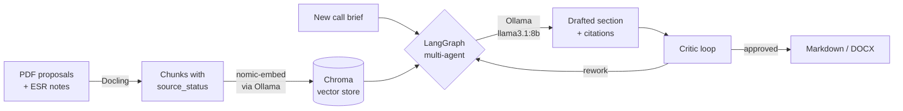

# Draft EU proposals locally — your IP never leaves the machine

EURPE indexes your past funded, rejected, and ESR proposals on disk and
drafts new sections with a multi-agent RAG workflow. Every chunk is
labelled `funded` / `rejected` / `esr_note` / `unknown`. No cloud LLM,
no hosted embeddings, no telemetry.

[**Deploy in 5 commands ->**](#deploy)
&nbsp;·&nbsp; [How it works](#how-it-works)
&nbsp;·&nbsp; [CLI usage](#use)

## The problem

EU proposal drafting (Horizon Europe, Horizon 2020, Digital Europe,
CEF) eats coordinator weeks. The work that would actually save time —
mining past proposals and ESR feedback for reusable framings — is
exactly the work you cannot ship to ChatGPT or Claude. Your draft is
the IP of the consortium.

The status quo: re-read three funded proposals, copy-paste the bits
that worked, hope you tagged what came from a rejected submission, miss
the ESR note that explains why. Repeat per call.

EURPE keeps the corpus, the index, and the LLM on `127.0.0.1`. The
default config ships with `offline_mode: true` and the FastAPI server
binds to loopback. A pre-flight egress probe fails the smoke test if a
new dependency tries to phone home.

## How it works



Every retrieved chunk carries an explicit `source_status` (`funded` /
`rejected` / `esr_note` / `unknown`). The generation graph propagates
that label into citations so a coordinator sees, per sentence, what
kind of evidence backs it.

## What you get

| Capability | Command | Output |
|---|---|---|
| Index a corpus | `eurpe index build` | Chroma index under `data/index/` |
| Retrieve evidence | `eurpe index query` | Ranked chunks with source-status labels |
| Draft a section | `eurpe generate section` | Markdown draft + citations |
| Audit citations | `eurpe generate audit` | Per-section source-label report |
| Run the MVP pilot | `eurpe pilot run` | `release-notes/pilots/<tag>.md` |
| Benchmark the stack | `eurpe benchmark all` | Latency vs. PRD targets |
| Export coordinator events | `eurpe analytics export` | JSONL of in-app events |

## <a id="deploy"></a>Deploy

EURPE deploys as a local stack on the coordinator's workstation. No
container, no cloud, no shared state.

**1. Install Ollama and pull the model.**

```bash
curl -fsSL https://ollama.com/install.sh | sh
```

```bash
ollama pull llama3.1:8b && ollama pull nomic-embed-text
```

**2. Clone and install in a venv.**

```bash
git clone git@github.com:luongnv89/eurpe.git && cd eurpe
python3 -m venv .venv && source .venv/bin/activate
pip install -e ".[dev]"
```

**3. Verify the local setup (no network calls).**

```bash
eurpe smoke
```

**4. Start the backend (loopback only).**

```bash
uvicorn eurpe.api.main:app --host 127.0.0.1 --port 8765
```

**5. Start the frontend.**

```bash
cd frontend && npm install && npm run dev
```

The dev UI opens at `http://127.0.0.1:5173`. The API listens on
`http://127.0.0.1:8765`. Neither binds to anything else.

## <a id="use"></a>Use

### Index your corpus

Drop PDFs into `proposals/` (gitignored, dev-machine only). Add a
sibling `<stem>.yml` per PDF with `programme`, `outcome`, and title;
defaults are synthesised if absent.

```bash
eurpe index build
```

### Draft a section

```bash
eurpe generate section --call HORIZON-CL4-2025-DATA-01 --section methodology
```

Output is Markdown with inline citations carrying source-status. Pipe
through `eurpe generate audit` for a per-section evidence breakdown.

### Run the pilot release gate

The MVP release gate is the pilot validation orchestrator (Task 3.7 /
issue #21). It composes citation audit, performance benchmark, and the
network-isolation smoke probe into one artefact.

```bash
eurpe pilot run --mode coordinator --runtime ollama \
  --output-dir release-notes/pilots/<release-tag>
```

```bash
eurpe pilot rate release-notes/pilots/<release-tag>/pilot-report.json \
  -s methodology --coordinator-id coord-a --rating 4 --time-saved 45
```

See [`docs/pilot-validation-runbook.md`](docs/pilot-validation-runbook.md)
for the full procedure and
[`release-notes/pilots/v1.0-pilot-smoke.md`](release-notes/pilots/v1.0-pilot-smoke.md)
for the most recent smoke-mode evidence trail.

## Tech stack

| Layer | Tool |
|---|---|
| Orchestration | [LangGraph](https://langchain-ai.github.io/langgraph/) |
| PDF parsing | [Docling](https://github.com/DS4SD/docling) |
| Local LLM | [Ollama](https://ollama.com/) (`llama3.1:8b`) |
| Embeddings | `nomic-embed-text` via Ollama |
| Vector store | [Chroma](https://www.trychroma.com/) |
| Backend | [FastAPI](https://fastapi.tiangolo.com/) + [Typer](https://typer.tiangolo.com/) |
| Frontend | React 18 + Vite 5 + Tailwind 3 + shadcn/ui |
| Storage | Local filesystem only |

## Privacy guarantees

- `offline_mode: true` is the default in `config.example.yaml` and must
  be preserved in `config.yaml` for confidential proposal work.
- FastAPI binds to `127.0.0.1` only (see `src/eurpe/api/main.py`).
- Vite binds to `127.0.0.1` only (see `frontend/vite.config.ts`).
- `proposals/`, `corpus/`, `*.pdf`, `*.docx`, `*.pptx`, `*.xlsx` are
  gitignored.
- The smoke command runs a pre-flight egress probe.

## Tests

```bash
make test        # fast tier: skips `e2e` and `docling` markers
make e2e         # full pipeline, deterministic offline stub
make e2e-real    # full pipeline against a real Ollama model
make test-all    # complete pre-merge gate
```

The E2E suite picks up every `*.pdf` under `proposals/` and
`tests/e2e/fixtures/`. Set `EURPE_E2E_REQUIRE_LLM=1` to fail loudly if
the offline stub is hit. CI runs the slow tier on push to `main`,
nightly at 03:00 UTC, and on manual dispatch.

## License

Proprietary — internal Montimage tooling. See `pyproject.toml`.

---

<details>
<summary><strong>Repository layout</strong></summary>

```
eu-research-projects/
├── prd.md                      # Product Requirements Document
├── tasks.md                    # Sprint task breakdown
├── pyproject.toml              # PEP 621 metadata + hatchling build
├── config.example.yaml         # Local config template (committed)
├── config.yaml                 # Real config (created by `eurpe smoke`, gitignored)
├── src/eurpe/
│   ├── config.py               # Typed YAML config loader
│   ├── cli.py                  # `eurpe` Typer CLI
│   ├── api/                    # FastAPI app (local /health endpoint)
│   ├── ingestion/              # Docling parsing + chunking
│   ├── retrieval/              # Hybrid search over Chroma
│   ├── generation/             # LangGraph multi-agent workflow
│   ├── pilot/                  # MVP pilot validation orchestrator
│   ├── benchmarks/             # PRD-target perf harness
│   ├── analytics/              # Coordinator-event export
│   └── export/                 # Markdown / DOCX exporters
├── tests/                      # pytest suite (fast + e2e tiers)
├── frontend/                   # React 18 + Vite 5 + Tailwind 3 + shadcn/ui
└── data/                       # Local corpus + index (gitignored)
```

</details>

<details>
<summary><strong>Schema invariant</strong></summary>

Proposal and chunk metadata are typed Pydantic v2 models in
[`src/eurpe/schema/`](src/eurpe/schema/). Every chunk carries an explicit
`source_status` drawn from the closed set `funded` / `rejected` /
`esr_note` / `unknown`, and a validator guarantees that a chunk's
status can never drift from its parent proposal's `outcome`. See
[`tests/fixtures/metadata/`](tests/fixtures/metadata/) for one round-trip
example per status.

</details>

<details>
<summary><strong>Smoke-mode pilot (no Ollama required)</strong></summary>

```bash
eurpe pilot run \
  --output-dir release-notes/pilots/<release-tag>-smoke \
  --output-markdown release-notes/pilots/<release-tag>-smoke.md
```

Deterministic stub, fine for structural assertions. Unsuitable for
evaluating real-proposal quality — use coordinator mode for that.

</details>

<details>
<summary><strong>Running E2E against a real LLM</strong></summary>

By default the E2E suite uses a deterministic offline stub for the
generation step so CI works on a fresh checkout without Ollama
installed. The stub emits clearly labelled placeholder text.

```bash
ollama serve &
ollama pull llama3.1:8b   # or whichever model your config.yaml names
EURPE_E2E_REQUIRE_LLM=1 make e2e
```

When the env var is set and the deterministic stub is hit (Ollama
unreachable, model missing, or `models.ollama_base_url` wrong), the
affected case fails with a message naming the env var and the next
steps.

</details>

<details>
<summary><strong>Full original README</strong></summary>

Preserved verbatim at [`README.backup.md`](README.backup.md).

</details>
