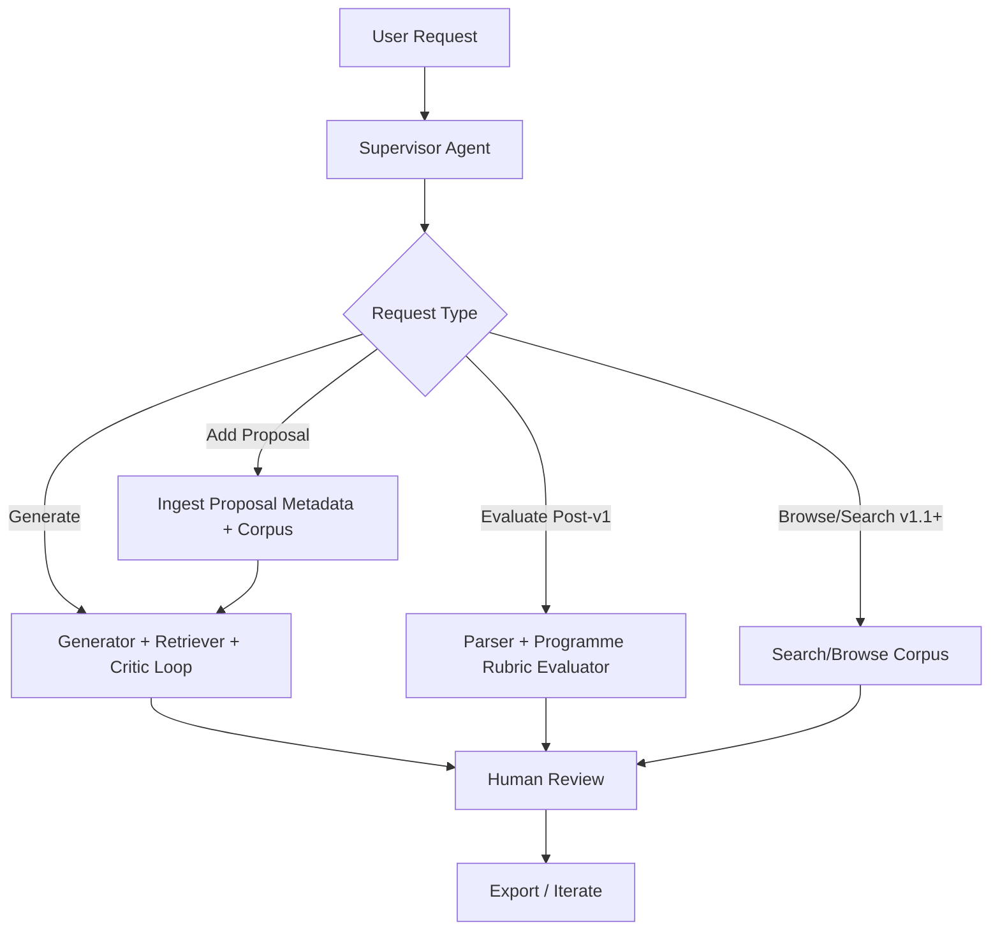
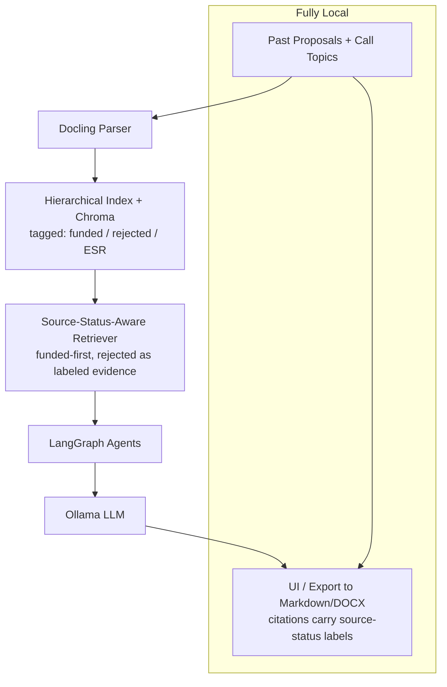

# Product Requirements Document: EURPE (EU Research Project Proposal Expert)

## Product Overview

**Product Vision:**
EURPE is a fully local, agentic AI system that transforms a private library of ~40 EU research project proposals (Horizon Europe, Horizon 2020, Digital Europe, CEF, and other EU programmes) into an intelligent knowledge base. It first enables rapid drafting of high-quality proposal sections, then expands into programme-specific evaluation against multiple EU rubrics — all while maintaining 100% data privacy on local hardware (Mac Pro M1 → NVIDIA DGX Spark).

**Target Users:**
- **Primary:** Proposal coordinators and Work Package leaders preparing EU research project submissions.
- **Secondary:** Technical writers, scientific leads, innovation managers, and partner organizations contributing to consortium proposals.

**Business Objectives:**
- Reduce proposal drafting time by ≥70% while improving alignment with the selected EU programme, call topic, expected outcomes, and section guidance.
- Cut internal review cycles by ≥80% in post-v1 releases with actionable, evaluator-style feedback grounded in past successful and unsuccessful proposals.
- Eliminate reliance on cloud AI for confidential consortium IP, partner data, and unpublished research ideas.
- Compound institutional knowledge from prior submissions (funded and rejected) into reusable patterns, boilerplate, and lessons learned, while clearly labeling outcome status in every citation or recommendation.

**Success Metrics:**
- **v1 drafting quality score** (user-rated 1–5): ≥4/5 on real proposal sections.
- **v1 time saved per proposal section:** ≥70% (measured via user logs comparing baseline manual drafting time to assisted drafting time on the same section type).
- **v1 citation fidelity:** ≥95% of generated claims or reusable patterns reference real past proposals, call documents, or explicitly marked user inputs. *Measured by manual audit of a random sample of ≥20 generated sections per release, with each citation checked against the source document.*
- **Source labeling accuracy:** 100% of cited proposal examples visibly show source status (funded, rejected, ESR note, or unknown). *Measured by automated check that every citation rendered in the UI carries a non-empty status tag.*
- **Post-v1 evaluator agreement:** ≥90% agreement with human reviewers on programme-specific scoring dimensions after evaluator simulation is introduced. *Measured on ≥10 historical draft/review pairs per supported rubric, with two human reviewers, agreement counted when scores are within ±0.5 points per dimension and the top 3 priority issues overlap by at least 2 items.*
- System adoption: ≥80% of target users generating ≥5 sections/month during active calls.
- **Network isolation integrity:** Outbound network access is blocked by default at the application/container boundary, verified by an offline-mode smoke test before release, and every attempted or explicitly allowed outbound request is logged locally; any non-opt-in outbound request constitutes a release-blocking incident.

## User Personas

### Persona 1: Alex Rivera – Senior Proposal Coordinator
- **Demographics:** 38, 10+ years coordinating Horizon Europe proposals, manages consortia of 8–15 partners, handles confidential partner contributions and unpublished IP.
- **Goals:** Quickly produce consistent, high-quality proposals aligned with the call's expected outcomes and impact pathways.
- **Pain Points:** "I spend 60–70% of my time adapting boilerplate from old proposals — partner descriptions, ethics sections, risk tables — and still miss alignment with the new topic's destination."
- **User Journey:** Pastes the call topic + abstract → reviews agent-generated section drafts with citations to past proposals → iterates with critic feedback against the selected programme and call requirements → exports a polished section draft.

### Persona 2: Jordan Kim – Work Package Leader / Internal Reviewer
- **Demographics:** 29, scientific/engineering background, strong domain expertise but limited time during proposal sprints.
- **Goals:** Validate WP descriptions, task breakdowns, and deliverables against historical winners; spot weak impact narratives early.
- **Pain Points:** "Reviewing a 70-page Part B days before deadline is brutal, and I still miss inconsistencies between objectives, WPs, and KPIs."
- **User Journey:** In post-v1 releases, uploads draft Part B → receives a scored report against the selected programme rubric with red-lines and examples from funded and clearly tagged rejected proposals → returns to coordinator with prioritized fixes.

### Persona 3: Sam Patel – Innovation Manager / Compliance Officer
- **Demographics:** 45, oversees the proposal portfolio across multiple calls, focuses on strategic positioning, ethics, gender, open science, and dissemination strategy.
- **Goals:** Maintain consistency across proposals; ensure mandatory cross-cutting issues (ethics, GDPR, gender dimension, open science, security) are correctly addressed.
- **Pain Points:** Knowledge is scattered across SharePoint folders; hard to enforce standards or reuse strong dissemination/exploitation sections across proposals.
- **User Journey:** In v1.1+ searches the knowledge base for patterns (e.g., "exploitation strategy for cybersecurity proposals") → uses synthesis tools to extract best-practice templates → monitors usage to enforce internal standards.

## Feature Requirements

| Feature | Description | User Stories | Priority (MoSCoW) | Acceptance Criteria | Dependencies |
|---------|-------------|--------------|-------------------|---------------------|--------------|
| **Knowledge Base Ingestion** | Secure, local parsing and indexing of proposal PDFs preserving tables (Gantt, effort, budget), figures (PERT, concept), and sectional structure across multiple EU programmes. | As a coordinator, I want to add past proposals so the system learns from funded and rejected ones without confusing their outcomes. | Must-have | Supports 40+ PDFs (60–120 pages); hierarchical chunking aligned to proposal sections; rich metadata (programme, call, topic, score, outcome, source status); incremental updates; rejected proposals are usable as tagged evidence and lessons learned; <2h initial indexing on M1. | Docling parser |
| **Call & Topic Awareness** | Ingest or paste call documents (Work Programme topic text, destination, expected outcomes) and use them as the targeting context. | As a coordinator, I want every draft tailored to the specific programme, topic, destination, and expected outcomes. | Must-have | v1 accepts pasted plaintext and uploaded PDF Work Programme excerpts; Funding & Tenders portal HTML deferred to v1.1; lightweight programme drafting profile selected (terminology, section guidance, expected-output fields, not scoring); destination/expected outcomes linked to draft prompts; agents cite topic requirements in outputs. | Docling + metadata schema |
| **Agentic Draft Generation** | Multi-agent workflow to generate proposal sections (objectives, state-of-the-art, methodology, WPs, impact, dissemination, ethics) with source-grounded critique. | As a WP lead, I want a methodology section drafted from my bullet points and past similar proposals. | Must-have | v1 supports single-section drafting first; citations to source proposals include funded/rejected/ESR status; self-check against selected programme and call requirements; critic loop runs up to 3 revision cycles by default (user-configurable 1–5) with explicit user stop available at any iteration; export to Markdown/DOCX. | LangGraph + Retriever |
| **Scoring Rubric Profiles & Evaluator Simulation** | Maintain configurable scoring/review profiles for Horizon Europe, Horizon 2020, Digital Europe, CEF, and other EU programme rubrics; use them for post-v1 evaluator simulation. | As a reviewer, I want a simulated evaluator report using the correct programme rubric, not a Horizon-only scoring model. | Should-have | v1.1+ supports programme-specific scoring dimensions and terminology; evaluator-style comments; red-line suggestions; citations prioritize funded proposals while rejected proposals are clearly marked as lessons or cautionary examples; agreement validated against the post-v1 evaluator protocol in Success Metrics. | Rubric registry + Evaluator Agent |
| **Knowledge Search & Browse** | Semantic + hybrid search across proposals, with filters by call, topic, partner, outcome, and section type. | As a user, I want to find how past proposals handled "gender dimension" in ICT calls. | Should-have | v1.1+ adds interactive hybrid search (BM25 + dense), filters, and section-aware previews; rejected proposals appear only when they pass the same relevance threshold as funded results or when the user enables "lessons learned / cautionary examples" mode. | Vector store |
| **Human-in-the-Loop & Iteration** | Approve, edit, or steer agent workflows mid-loop. | As a coordinator, I want to redirect the critic loop when it over-rotates on one criterion. | Should-have | Pause/resume agents; feedback persisted into next iteration; per-section memory. | LangGraph state management |
| **Cross-Cutting Compliance Checks** | Automatic checks for ethics, GDPR, gender dimension, open science, security self-assessment, and DoA consistency. | As a compliance officer, I want a pre-submission checklist run automatically. | Should-have | Generates compliance report; flags missing/weak sections; links to required templates. | Rules engine + LLM checks |
| **Wiki-Style Synthesis** | Optional high-level pattern extraction into an evolving internal wiki (e.g., reusable impact pathways, KPI templates). | As an innovation manager, I want synthesized best-practice pages. | Could-have | Periodic synthesis run; maintainable Markdown knowledge base; version-controlled. | Optional LLM synthesis agent |
| **Section Export & Reporting** | One-click Markdown/DOCX export for generated sections, with later expansion to full Part B PDF/DOCX templates. | As a user, I want a polished section draft that preserves citations and can be pasted into the official proposal template. | Must-have | v1 exports section-level Markdown/DOCX; citations and source-status labels preserved; post-v1 adds full Part B templates, PDF export, embedded tables, and page-limit warnings. | Template engine |

## User Flows

### Flow 1: Generate New Proposal Section
1. User selects "Generate Section", picks the section type (e.g., Impact → Pathway), and pastes the call topic + a short intent.
2. Supervisor routes to Generator Agent → Retriever pulls similar sections from funded proposals first, plus clearly tagged rejected examples when they add useful technical or cautionary context.
3. Draft created → Critic Agent checks alignment against the selected programme drafting profile and call topic → revision cycles run per the configured limit (see Agentic Draft Generation acceptance criteria), with user able to stop at any iteration.
   - Alternative: User provides partial draft for refinement.
   - Error: Low-confidence retrieval (no comparable past proposals) → prompt user to broaden topic or add reference proposals.

### Flow 2: Evaluate Uploaded Proposal Draft (Post-v1)
1. User uploads a draft Part B (PDF/DOCX).
2. System parses with Docling → Evaluator Agent selects the correct programme rubric → retrieves comparable funded proposals and clearly tagged rejected examples.
3. Generates scored report using the selected programme rubric + red-lines + concrete rewrites.
   - Alternative: Partial evaluation (specific sections only, e.g., only Impact).
   - Error: Parsing failure → fallback to text extraction + user notification.

### Flow 3: Add Proposal to Knowledge Base (v1)
1. User uploads a proposal PDF or extracted proposal document.
2. System parses, chunks, and indexes the document with required metadata (programme, call, topic, outcome/source status).
3. User confirms or corrects metadata before the document becomes available to generation workflows.
   - Error state: Duplicate detection by title + call ID.

### Flow 4: Browse & Search Knowledge Base (v1.1+)
1. User searches or browses the indexed proposal library by call, topic, partner, outcome, or section type.
2. Views section-level previews with metadata (programme, call, score, outcome, year, funded/rejected/ESR status).
3. Enables "lessons learned / cautionary examples" mode when they explicitly want rejected proposal examples surfaced alongside funded examples.
   - Error state: No relevant examples → suggest broader filters or ingestion of additional proposals.

## Non-Functional Requirements

### Performance
- Initial indexing: <2 hours on Mac M1 32 GB for 40 proposals.
- Section generation (5–10 pages): <2 min on M1, <30s on DGX.
- Post-v1 full proposal evaluation (80-page Part B): <10 min on M1, <2 min on DGX. *Targets assume a 14B–32B model with single-pass section-level rubric application; complex rubrics, very long context windows, or chained critique passes may extend these bounds and will be re-baselined when evaluator simulation ships.*
- Internal retrieval latency for generation: <2s for top-k retrieval on the indexed v1 corpus.
- Interactive search/browse latency (v1.1+): <2s for filtered section-level results.

### Security
- 100% local execution — no proposal content, partner data, or call material leaves the machine.
- Network access disabled by default during proposal processing. The app must run in an offline/egress-denied mode by default (e.g., Docker network isolation on DGX and process/firewall allowlisting on macOS). Proposal content, prompts, retrieved passages, generated draft text, partner data, and call material must never be sent to external services in v1.x; any non-content external model, API, update check, package fetch, or telemetry endpoint requires explicit user opt-in and a recorded allowlist entry.
- Optional filesystem encryption for the vector store.
- No telemetry of document content. Local analytics (see Analytics & Monitoring) remain on disk and have no auto-export path; any export is an explicit user action.
- Audit logs cover user actions, document-processing events, network egress attempts, and explicit outbound allowlist approvals. Logs must never store proposal content, retrieved passages, generated draft text, or partner-confidential details.
- Suitable for proposals containing pre-publication research, partner-confidential IP, and security-sensitive topics.
- **v2.0 multi-user note:** Shared DGX use introduces authentication, role-based access control, and per-user audit trails for content access. v2.0 requires a separate security review before release and is out of scope for v1.x.

### Compatibility
- Development: macOS (Apple Silicon).
- Production: Linux (NVIDIA DGX Spark).
- UI: Desktop browser (local React app built with Vite).

### Accessibility

- **v1 target:** Accessible-by-default React UI using shadcn/ui components, Tailwind CSS design tokens, keyboard navigation for primary flows, readable contrast, resizable text, and screen-reader labels on generated reports.
- **v1.2 target:** Full WCAG 2.1 AA validation and hardening, including audit evidence for custom React flows, focus management, contrast, form errors, generated reports, and export controls.

## Technical Specifications

### Core Architecture
- **Orchestration:** LangGraph (multi-agent stateful workflows).
- **Parsing:** Docling (layout, tables, figures, sections).
- **Local model runtime:** Ollama or MLX-backed local runtime on Mac; vLLM on DGX; embeddings via nomic-embed-text or equivalent local embedding model; 14B–70B local LLMs depending on hardware.
- **Storage:** Chroma (default), with pgvector/FAISS fallback.
- **Frontend:** React + Vite + Tailwind CSS + shadcn/ui for a local browser-based application.
- **Programme Drafting Profiles (v1):** Lightweight config profiles for programme terminology, section guidance, expected-output fields, and source-labeling rules. These are not scoring rubrics.
- **Scoring Rubric Profiles (v1.1+):** Config-driven scoring/review profiles for Horizon Europe, Horizon 2020, Digital Europe, CEF, and future EU programmes. Profiles are versioned alongside the call year (e.g., `horizon-europe-2025.yaml`) because rubrics and Work Programme guidance change between cycles; the active profile must be recorded with every evaluation report.
- **Retrieval Policy:** Source-aware ranking that prioritizes funded examples for positive patterns while allowing rejected proposals as visibly labeled lessons learned or cautionary evidence. Rejected examples must meet the same topical relevance threshold as funded examples unless the user explicitly enables "lessons learned / cautionary examples" mode.

### Infrastructure
- Local filesystem persistence.
- Docker support for consistent Mac ↔ DGX deployment.
- No external hosting required.

## Analytics & Monitoring
- **Key Metrics:** Generation time, user iteration count, citation usage per section, source-status mix (funded/rejected/ESR), and post-v1 simulated evaluator scores.
- **Events:** Draft start/complete, post-v1 evaluation complete, feedback given, export.
- **Dashboards:** Local React analytics page (usage trends, score distributions, time-to-submission).
- **Alerting:** High parsing error rates or low-confidence generations.

## Release Planning

### MVP (v1.0)
- Ingestion, basic RAG retriever, lightweight programme/call topic awareness, section drafting agent, React/Vite/Tailwind/shadcn UI, Markdown/DOCX section export.
- Timeline: 4–6 weeks at full-time effort; 3–4 weeks is achievable only if ingestion and the agent workflow can reuse existing internal scaffolding and a single engineer is dedicated to the build.
- Success Criteria: Coordinators can generate real proposal sections with ≥4/5 satisfaction on at least one active call, with citations that clearly label funded/rejected/ESR source status.

### Future Releases
- **v1.1 (4–6 weeks later):** Configurable scoring rubric profiles, evaluator simulation, human-in-the-loop, interactive search/browse, and stronger critic loops.
- **v1.2:** Cross-cutting compliance checks, wiki synthesis, PDF export, Docker productionization on DGX, and WCAG 2.1 AA accessibility validation/hardening.
- **v2.0:** Multi-user consortium support, GraphRAG over partner/topic relationships, self-improving critic prompts based on outcome feedback.

## Resolved Decisions & Assumptions

### Decisions

- **Tables & figures:** The corpus contains rich tables (Gantt, PERT, effort allocation, budget, deliverables, milestones, risk tables). Docling is the primary parser; a MinerU fallback path must be available for low-quality scans or table-extraction failures.
- **Multi-user on DGX:** Multi-user shared use on the DGX during proposal sprints is in scope (planned for v2.0). MVP and v1.x remain single-user per machine.
- **Drafting profiles vs. scoring rubrics:** v1 uses lightweight programme drafting profiles for section generation and call alignment. v1.1+ introduces scoring rubric profiles for evaluator simulation. EURPE must support many EU programmes and rubrics rather than assuming Horizon Europe only, and rubric behavior must be profile-driven so new programmes can be added without rewriting the evaluator workflow.
- **Rejected proposals & ESR ingestion:** Rejected proposals are ingested into the main corpus because they still contain useful technical, consortium, work-plan, and domain information. They must be clearly tagged as rejected/not funded in retrieval results, citations, and generated recommendations. ESR feedback is ingested into a **separate, clearly tagged sub-corpus** ("ESR notes") and is treated as advisory only — never used as ground truth. The retrieval layer and post-v1 Evaluator Agent must:
  - Surface ESR-derived insights with a visible confidence caveat ("ESR commentary — subjective, not ground truth").
  - Never auto-apply ESR-style corrections without user confirmation.
  - Weight funded-proposal patterns above ESR commentary in retrieval ranking.

### Assumptions (confirmed)

- **Assumption 1 (confirmed):** Users are comfortable with a local web UI.
- **Assumption 2 (confirmed):** 14B–32B models provide sufficient quality on M1; larger models on DGX will exceed targets.
- **Assumption 3 (confirmed):** Past proposals are available with outcome metadata (funded / not funded, ESR scores when accessible).

## Appendix

### Competitive Analysis
- **AnythingLLM / PrivateGPT:** Good local chat-with-docs but no agentic multi-step generation/evaluation, no EU-criteria awareness.
- **LlamaIndex-based tools:** Strong ingestion but less orchestration than LangGraph for iterative critic workflows.
- **Commercial proposal tools (e.g., Grantable, Granted AI, Mystrius):** Cloud-dependent; unsuitable for confidential consortium IP and security-sensitive topics.
- **Strength of EURPE:** Full agentic control + 100% local + specialized for EU framework programme proposals, with multi-rubric evaluator awareness.

### User Research Findings
- Common pain points: Scattered proposal archives, last-minute rewriting of boilerplate (ethics, partner descriptions, dissemination), inconsistency between objectives/WPs/KPIs, weak Impact narratives.
- Users value citation-backed suggestions and iterative refinement against the selected programme/call requirements most highly.

### AI Research Insights
- **Round 1 (Market Trends):** Agentic RAG and multi-agent systems (LangGraph) are the dominant 2026 pattern for complex document workflows. Strong demand for private/local solutions in regulated/IP-sensitive contexts.
- **Round 2 (Features):** Iterative generation with critic agents and LLM-as-Judge evaluation rank highest in value for grant/proposal tooling.
- **Round 3 (Feasibility):** Docling + LangGraph + Ollama is production-viable on described hardware; hybrid search recommended for proposal corpora.
- **AI-Generated Edge Cases:** Poorly scanned legacy proposals, conflicting partner contributions, very long Part B docs exceeding context, ambiguous topic interpretation, multilingual partner sections.
- **AI-Suggested Improvements:** Confidence scoring on outputs, version control for the knowledge base, A/B testing of critic prompts against past ESR feedback.

### Glossary
- **EURPE:** EU Research Project Proposal Expert.
- **Part B:** The technical/scientific section of an EU proposal (Excellence, Impact, Implementation).
- **ESR:** Evaluation Summary Report issued by EU evaluators.
- **WP:** Work Package — structural unit of an EU proposal's implementation plan.
- **DoA:** Description of the Action — the binding technical annex of a funded EU project.
- **Agentic:** AI systems that reason, use tools, and iterate autonomously.
- **RAG:** Retrieval-Augmented Generation.
- **Hierarchical Chunking:** Preserving document structure (sections, tables, figures) during indexing.
- **Docling:** Primary document parser used for layout, table, figure, and section extraction from proposal PDFs.
- **MinerU:** Fallback document parser used when Docling fails on low-quality scans or complex table layouts.
- **Funding & Tenders Portal:** EU portal hosting Work Programme call documents and topic descriptions.

---

This PRD is complete, actionable, and focused on **WHAT** the EURPE system must achieve for EU research proposal workflows. It can be refined per call cycle and per consortium need.
